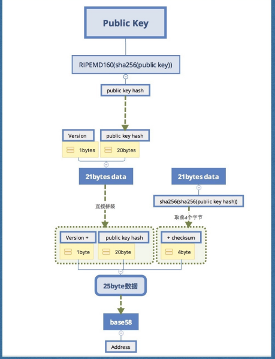
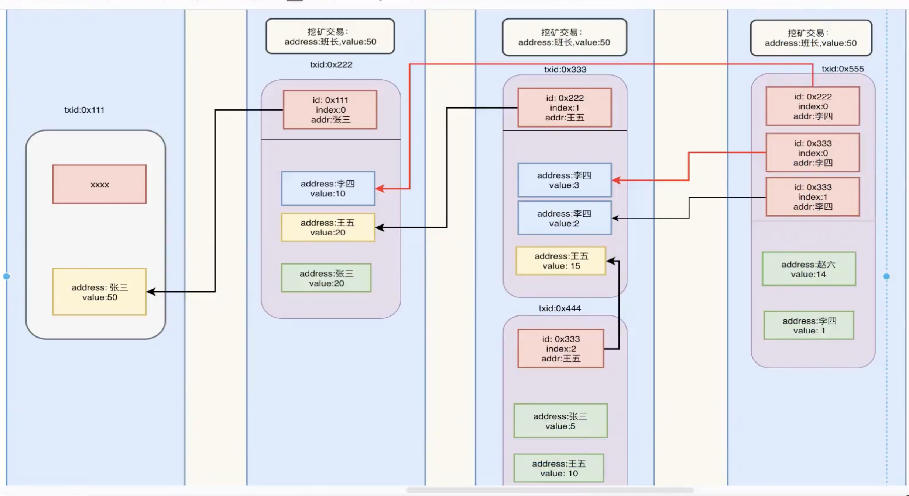

#    区块链


```yaml
version: '3.7
services:
	prometheus:
	image: prom/prometheus:latest
	container_name: prometheus
	restart: on-failure:1
	ports:
		"9090:9090'
	# volumes:
	# 	-${CONF DIR}/prometheus/:/etc/prometheus/
		deploy:
			resources:
				limits:
					memory: 4G
```


## 基础

### 名词解释

#### PoW

```go
 工作量证明：挖矿算力（计算能力）， 解决计算复杂的计算题成为区块链的验证者。第一个解决难题的矿工将成为新区块的验证者，并获取一定数量的coin做为奖励
```


#### PoS

```go
权益证明：矿工需要通过质押加密货币的权益，获得被随机选为验证者的机会。

像买彩票买的越多中奖机率越大，  质押量更多的验证者将获得更多的奖励。


```

#### DPoS

```go
Solana 以太坊2.0 Avalanche 参与者需要质押 特定数量的网络原生通证才能成为验证者。正确参与验证过程的验证者将获取奖励。 奖励规则因网络而异
```

#### Tendermint 拜占庭

```go
基于拜占庭容错（BFT）的 PoS 共识机制

拜占庭容错（BFT）共识机制的目标是在网络中容忍拜占庭节点（恶意或不可靠的节点），确保系统能达成共识。BFT 机制的一些关键特性包括：
	•	容错性：BFT 系统可以容忍一定数量的拜占庭节点（假设最多1/3的节点是拜占庭节点）。
	•	一致性：即便存在恶意节点，所有诚实节点的状态都将保持一致。
	•	终止性：诚实节点都能在有限时间内达成共识，避免无限等待或僵持。

优点
	•	容错性强：允许存在拜占庭节点，确保即便部分节点作恶，系统也能继续正常运行。
	•	高安全性：避免恶意节点对数据进行篡改或双重支付，适合高安全要求的应用场景。

缺点
	•	复杂度较高：需要多个通信轮次，在节点数量增加时通信开销显著增加，不适合大规模公链。
	•	易受恶意节点攻击：虽然能容忍部分拜占庭节点，但若恶意节点占据超过协议容忍的比例，则共识会被破坏。

人话：无论多少个节点， 目标是为了达成一致。
	所有的节点相互发送消， 所有节点收到的消息会同步给其他节点， 表示自己赞同或反对， 最终以数量多的为准
保证肯定对的计算为： n >= 3m+1, n为节点总数， m为恶意节点数 m <=(n-1)/3

```


#### PoA

```go
权威证明
```


#### 共识

```go
也称共识协议/算法 确保区块上所有节点彼此同步（达成一致）的“规则”。换句话说，它是一种可以让节点验证者就“可以将哪些交易添加到区块中”
```

#### DApp

```go
去中心化应用程序（decentralized application），它是在去中心化的点对点（P2P）网络或区块链上运行的数字应用程序。
```

#### EVM

```go
EVM（Ethereum Virtual Machine）以太坊虚拟机就是智能合约的运行环境
```


#### EIP

```go
EIP 也作为以太坊的治理机制，因为 EIP 对于促使以太坊发生变化并对其进行记录至关重要。这是一个过程，以太坊社区成员提议、评估并实施网络更新。
```


#### GAS

```go
在以太坊中，交易、执行智能合约，或是支付数据储存费用， 需要进行计算消耗网络资源，最终燃料费作为手续费支付给矿工
```

#### Layer 2

 在通过在主链==外==执行==交易和智能合约==来==提高==区块链==主网的可扩展性和效率的机制==,减少网络拥塞、降低交易费用并增加交易吞吐量

```go
建立在区块链（比特币、以太坊等）之上的扩展解决方案的集合。 
主要目标是解决:提高区块链的交易速度

二层网络从一层网络接过相当数量的交易负担，从而使一层网络变得不那么拥挤

二层网络解决方案是通过提交打包交易的方式定期与一层网络进行通信，它们仍然可以拥有一层网络的安全性。
```

#### Rollup

```go
是一种二层网络（Layer 2）解决方案。

rollup 特定类型的layer2， 它将多个交易捆绑或汇总到一个证明中，再发布到主链上

有两种类型：乐观汇总(Optimistic Rollup) 零知识汇总(ZK-Rollup)
OptimisticRollup: 依赖于用户在恶意行为的情况下提交欺诈证明
ZK-Rollup: 确保交易的有效性，不需要主链验证每笔交易的细节


二层网络有什么样的类型？

```

#### Blob

```go
Binary Large Object 一种数据形式， 表示从layer2回传过来的数据和layer1上的callData分开

简单来说Blob是一个外部临时存储， 并没有把真正 Layer2交易数据存储到layer1中，减少layer1的存储成本， 
```


#### IBC

```go
区块链间的通信协议， 信息可在执行该协议的不同区块链间传输
```

#### Polygon

```go
区块链网络和扩展解决方案/协议， 协助开发人员创建兼容以太坊的网络

可以更低的费用和更快的速度，获得类似于以太坊的使用体验

理解为二层网络
```


#### zkEvm

```go
什么是 zkEVM？

zkEVM 是如何工作的？

zkEVM 的工作原理 

什么是 zkEVM 操作码？

是什么让构建 zkEVM 变得困难？

为什么 zkEVM 很重要？

有哪些类型的 zkEVM？

我们在 zkEVM 的开发进度中处于什么位置？

https://maimai.cn/article/detail?fid=1760111280&efid=aW8f81QzTta3sfMMNulrGQ
```


#### 不可能三角

```go
去中心化、安全性和可拓展性
```

#### 分片

```go
分片允许节点只处理自己分片内的交易。它将区块链网络分成多个小的区域, 每个区域隔离， 区块链网络节点保存储和处理自己分片内的交易

```

#### 分布式账本

```go
一个去中心化的数据库， 用于在多个网络参与者之间记录和分享交易。每个参与者记录交易的真实性和一致性 由共识机制和加密工具来保障

特点：
安全、透明
```


#### 节点/验证者 

```go
负责验证链上交易， 当一笔交易验证成功时， 验证者会把这夂交易添加到分布式账本中

Pow 共识机制中的验证者。 验证者=矿工， 通过解决复杂的计算问题来获得验证交易的权力。获得奖励基于他们的工作量
```


#### 零知识证明 

Zero-knowledge Proof

```go
一种证明方法， 证明者 向 验证者， 证明一个陈述是真实的。 且除真实之外不透露任何信息

应用于rollup场景里。 底层区块链将计算外包， 同时保证计算结果的可验证性。
链下的计算机执行交易 --> 结果以及正确执行交易的证明。 减少链上网络拥塞并提高了交易速度
```


#### 流动性质押

质押： 锁定某一使用PoS共识机制区块链的原生资产，帮忙维护该区块链运行并赚取相应回报的过程.

质押 先要成为区块链网络的验证者。 需要符合一定条件的硬件设备 和32ETH 进行质押。质押的ETH锁在智能合约中， 无法它用 降低流动性

```
用户不直接参与传统质押， 转而向流动性质押平台提供ETH。 平台将收集参与用户提供的ETH, 将这些ETH打包分成32枚 一份分给符合条件的网络验证者。 由这些网络验证者进行传统质押， 质押获得的收益将由用户、流动性质平台、网络验证者共同分享。 
```


#### MEV

全称： maximal extractable value  

```go
指的是在标准的区块奖励和gas费之外， 通过包含、排队、更改一个区块的交易顺序， 可以从区块生产中赚取最高价值
例：
a 要花10000买10个eth (交易在内存池中进行。)
MEV机器人发现a的交易， 会下两个额外的订单包含在同一个区块中
mev 会以 10000 买下这10个ETH
再以 10050的价格卖给 a
a最终以 10050 买下10个ETH

前提条件 a 下定单设置的滑点(slippage)

理解为二手贩子， 挣个差价
```


#### Nonce

```go
是矿工用来验证新区块的一个任意数字。

在PoW共识机制下， nonce是区块头的一部分， 区块头包含以下：
- 区块链版本号
- 上一个区块的哈希
- 当前区块的哈希
- Merkle根
- 难度目标
- Nonce， 是一个32位字段， 提供了2^ 32(4,294,967,296) 位的搜索空间。搜索空间巨大， 不可能在没有计算的情况下进行 “猜测”， 这种迭代计算消耗时间和资源， 构成所谓的 “工作证明(PoW)” 中的 “工作” 这种计算过程也被称为 “挖矿”
```

#### 女巫攻击

```go
恶意攻击者在区块链网络中创建多个 “虚假身份或节点”。 以获得不当的影响和控制力。攻击者可以使用这些众多的虚假身份来操纵网络、破坏其功能或进行其他恶意活动。

如何避免遭受女巫攻击？
一： 使用pow工作量证明 通过要求攻击者控制网络节点的大部分所需要的大量计算资源， 使用女巫攻击变得更加昂贵和复杂。
二： PoA权益证明, 它结合了PoW 、PoS 系统元素， 在成功挖新区后， 系统转变为类似于PoS系统。这种混合方法要求攻击者在哈希算力和权益证明方面具有优势。
```

#### 空投

```go
是向大量用户免费分发代币或以完成小任务作为交换的活动。 通常用于推广新项目或者奖励现有用户。
```

#### OP Stack

```go
一个开源区块链框架。 通过提供一个面向开发者的环境， 使区块链的创建更为简单
```

#### Plasma

```go
提高 以太坊的可拓展性、解决交易拥堵 Layer2 扩容解决方案

运行原理：为链下交易处理及交易全集状态上传的过程
用户需要通过智能合约将资产存入Plasma链， 所有与用户资产相关的交易都会由Plasma链的运营商按照一定的顺序排列， 然后打包成一个交易批次进行处理

如今，大部分 Plasma 链已经被乐观 rollup 和 zkrollup 所取代。 归根结底，造成这种情况的主要原因是 Plasma 链的数据不可用性，即，以太坊主网无法获取到每笔交易的原始数据。

```


#### 区块 Block

```go
区块链是由一个个区块根据各自生成的时间顺序相互连接形成的链状存储结构，区块就是这个结构中的基本数据储存单元。
```

#### 创世区块

```go
第一个块， 没有父级块
创世区块的生成一般代表该区块链正式开始运行，创世区块中的数据将被加密并记录在该区块链后续所有的区块中。
```


#### 区块链 Blockchain

```go
区块链是一种数据库结构， 由一个又一个区块组成， 每个区块中存储了一定大小的数据， 区块按照各大自生成的时间顺序相连形成链状结构，这就组成了区块链

特点：去中心化、难以篡改、公开透明


```

#### 区块链特点

##### 去中心化

```go
区块链由许多服务器共同维护，每个参与维护的服务器都存储了区块链中所有数据的副本。 只要整个系统中还有一台服务器还在运作，区块链上的数据就不会丢失。这些服务器在区块链系统中被称为节点， 它们为整个系统提供储存空间和运行支持
```

##### **难以篡改**

```go
相邻的两个区块通过加密算法连接在一起。
前一个区块中有数据将被加密成一个加密摘要， 并记录在下一个区块中。 每个区块的生成都依赖于前一个区块记录数据， 以此形成一条链，因此某一数据一旦被记录在某一区块中， 就会不断被加密以摘要的形式传到后续的每一个区块中， 篡改某区块中的数据， 就支导致之后所有的区块数据发生改变。但由于之后的区块进了已被所有节眯记录， 因此需要所有节点共同个性， 也压根征得半娄以上的节点同意
```

##### 公开透明

```go
区块链技术基础是开源的，区块链的数据对所有人开放，所有人都可以通过公开的接口查询区块链中的数据，并开发相关应用，因此整个区块链系统是公开透明的。
```

#### 区块链的四个基本功能

##### **执行层 Execution Layer**

```go
在区块链上执行是指计算并处理交易， 以使得区块链从一个状态转变为下一个状态
```

##### **结算层 Settlement Layer**

```go
结算是指争议解决。它仅在rollup场景中相关， 在独立完整的Layer1区块链上并不是必须的。 由于Rollup需要在底层区块链上汇总并确认Rollup上的交易。因此需要在结算层上解决可能产生的任何差异或者错误
```

##### **共识层 Consensus Layer**

```go
共识是关于区块链交易的排序和最终确认。在共识层， 区块链网络上的节点下载并执行一个区块中的所有交易， 并就它们的顺序和有效性达成一致
```

##### **数据层 Data Availability Layer**

```go
数据层或者说数据可用性是指rollup在底层区块链上提供汇总的交易数据， 以便任何人都可以重新创建交易前的状态、执行交易并验证期有效性。数据可用性也是Rollup有关， 因为黑夜情况下的觉的layer1区块链上的交易数据一直都可以随时查看或检验
```


#### RPC

```go
远程程序调用， 通信技术，一台计算机调用另一台计算机上的程序并执行， RPC 是API接口的一种

去中心化应用DApp 想要连接区块链网络就需要先连接到节点， 然后通过节点与区块链网络交互(读数据或执行智能合约)， Dapp 连接节点也需要用到RPC

```


#### **Nodes as Service (节点服务商)**

```go
DApp 开发者可以通过两种方式来连接节点。
第一，自己运行一个节点，通过自己的节点与区块链网络互动。
第二，与其他节点合作，尤其是节点服务提供商，使用他们的节点。

相对于第一种方式，选择服务商会在一定程度上降低开发者的时间和开发成本。但是，选择服务商也相当于将部分产品的运行与第三方服务商挂钩，会存在一定的中心化风险。


```


#### BitVM

```go
BitVM 提供了一个计算框架， 允许在bitcoin上执行复杂的合约， 而不改变其核心原则。 
```


#### 什么是上海升级 Shanghai Upgrade

```go
以太坊上海升级是继 2022 年 9 月 15 日完成的 The Merge 后以太坊的下一次重大升级。上海升级将包括一系列备受期待的优化方案，如 EIP-4895，其将允许用户提取被质押的 ETH。
```


#### 智能合约 Smart Contract

```go
智能合约是部署在区块链网络上的程序。当预设条件满足时，智能合约会自动执行。例如，Bob 使用智能合约为其女儿 Alice 创建一个信托基金，该基金在 Alice 满 18 岁前保持锁定，且当 Alice 年满 18 岁时，该基金将自动解锁并转入 Alice 的账户，无需手动干预。
```

#### 账户模型 Account Model

```go
账户模型是一个计算模型。 当交易发生时，系统会根据用户的交易指令，触发节点改变账户余额。 然后由系统计算每个账户中余额的变化并记录余额的最新状态。

在以太坊中，账户的状态不存储在区块链上，而是由节点在本地计算和存储。区块链上只存储交易指令。
```


##### 外部所有账户 (EOA, Externally Owned Account)

```go
指由私钥控制的用户帐户。用户可以在 MetaMask 钱包中创建此类账户。 每个 EOA 都有一个私钥和一个地址，它可以直接发起交易。
```

##### 合约账户 (Contract Account)

```go
指由智能合约代码控制的账户
与 EOA 不同，合约账户没有私钥，它拥有一个智能合约代码。 该账户由其智能合约代码运行。 代码在合约账户创建时记录在链上，并由 EVM 执行。

```

#### 账户抽象 Account Abstraction

```go
简单来说就是一种将 EOA 和智能合约相结合的技术。它允许用户使用由智能合约控制的账户进行交易。换句话说，也就是使用“智能合约钱包”来处理交易。“智能合约钱包”可以理解为由智能合约控制的 EOA。它同时拥有合约账户和 EOA 的功能，可以帮助用户实现更加安全且灵活的交易。
```


#### 状态通道 State Channel

```go
状态通道是一个 Layer 2 扩展方案，它允许参与者安全且免费地进行任意数量的链下交易，并只需在开启和关闭通道时支付 gas 费用。因此，状态通道可以实现以尽可能低的 gas 费用，支持更大的交易吞吐量。
```


#### 多签交易

```go
```


#### DeFi

```go
Decentralized Finance，即“去中心化金融”，是指运行于区块链等去中心化网络（例如以太坊）上的金融应用生态系统，通常不受任何中央机构或中介机构的控制。相反，它们在去中心化网络上使用智能合约来执行交易的条款并受条款约束，使用户能够直接完成交易，而无需传统金融机构的参与。与传统金融（TradFi）相比，这种模式具有更高的透明度和可访问性。但其安全性是否真的优于传统金融尚有争议。

DeFi代表了一个新的金融时代，它是开放的、透明的，任何联网的人都可以访问。

```


### 3.区块链场景概念

```go
1.数字货币:可以与现金流进行等价交换，拥有现有现金流的属性和功能
2.1C0:众筹
3.电子钱包:在商的购物中常用的支付工具
```

### 4.什么是区块链(定义)
```go
1.区块是一种集成了点对点传输协议，现代密码学，共识算法，分布数据存储等成型技术新型的应用模型
```

### 5.区块链特点

```go
1.可追溯
2.不可篡改
3.去中心化
4.完整备份:区块链具有完整的分布式存储特性
5.历史记录:被存储的数据拥有完整的历史记录，可以快速查看，复原
6.交易广播:一次交易分发给网络中的其它节点，同步进行接收
```

### 6.区块链加密货币特点

```go
1.独立性:所有货币都是独立存在的
2.唯一性:地址、交易都具有不重复的唯一性
3.匿名性:账户信息和个人信息没有关联，整个交易过程全程加密
4.不可伪造
```

### 7.区块链核心技术

```go
1.点对点传输协议:在网络中的数据流通方式
2.现代密码学:在区块链中的应用:公私钥签名、哈希算法
3.共识算法:数据-致性
4.分布式数据存储:实现去中心化的重要技术依据
```


###  8.区块链核心概念

#### 1.区块链

```go
1.本质:一个分布式账本，通过共识算法来决定谁能抢到当前的记账权。区块链以区块为单位，以区块产生的时间顺序去进行连接，
```

#### 2.区块

##### 1.概念

```go
区块链的基本组成单位
```

##### 2.区块头

```go
1.时间戳
2.当前区块哈希
3.父区块哈希
4.随机数
5.Merkle树
6.区块号码
```


##### 3.区块体

```go
交易数据
```


**区块结构**

| 大小             | 字段       | 描述                             |
| ---------------- | ---------- | -------------------------------- |
| 4字节            | 区块大小   | 用字节表示的该字段之后的区块大小 |
| 80字节           | 区块头     | 组成区块头的几个字段             |
| 1-9 （可变整数） | 交易计数器 | 交易的数量                       |
| 可变的           | 交易       | 记录在区块里的交易信息           |


#### 3.分布式数据库

```go
区块链中的区块数据都存储在每一个节点中，所有节点组成一个分布式数据库。任何一个或者多个节点退出，都不会影响其它节点，因为每个节点都保存了完整的数据
```

#### 4.节点

```go 
计算节点，运行区块链程序的计算机
```

##### 节点分类

```go
1 全节点，保证完成区块链副本， 安全性级高。效率不高
2 轻节点，效率高，安全性低 不需要保存全部， 但需要去全节点进行验证， 轻节点只下载块头
以上两节点 ，主保存数据
3 挖矿节点，带有挖矿功能全节点， 专门处理交易验证
```


### 9.挖矿

```go
1.对交易进行验证处理(记账)，区块就是通过挖矿产生的
2.穷举随机数算法，生成哈希，与目标哈希进行比较，成功则说明挖矿成功

挖矿是PoW共识机制的核心。除了挖出新币， 挖矿还是一个帮助验证交易的有效性， 维护网络安全的机制

```


### 10.分叉

#### 1.升级分叉

Etc eth 

```go
1.矿工遵从不同的机制(规则)导致分叉
2.硬分叉:如果区块链共识规则改变之后，不允许前向兼容，旧节点没有办法认可新节点产生的区块
3.软分叉:如果区块链共识规则改变之后，允许前向兼容，旧节点可以兼容新节点产生的区块
```


#### 2.挖矿分叉

```go
1.现象:两个或者多个矿工，同时完成了工作量证明(POW)，就会产生两个新的区块，形成分叉
2.解决方案:不同矿工跟随了不同的区块，但是不同链算力会有区别，矿工的数量一样，链的增长速度就不会相同，最终会出现一个条链更长，这条就会变成主链。
```


### 11. 51%攻击


  

### 12.双花

```go
双花
1.概念:复用数字货币的数字特性，可以完成两次或者多次支付
2.传统虚拟货币之所以可以避 免双花是因为有可依赖的第三方机构提供保证
3.区块中需要达成只通过分布式节点之间的相互校验与共识机制来避免双花，同时完成价值转移
```

### 13. UTXO(unspent transaction output)交易模式

```go
1.是比特币独有的交易模式，比特币交易过程中的基本单位，主要就是为了避免双花


```

### 14.哈稀

```go
哈希
1.将任意的原始数据(交易记录)通过指定哈希函数，编码为特定长度的字符串
2.在区块链中的使用:生成地址，交易验证
3.特点
1.不可逆
2. 随机性
3.时间正相关:输入的源数据越长，哈希的处理时间就更长12.加密算法
```


### 15.Merkle树 数据结构

```go
1.Merlkle树可以二又树，也可以是多叉树，它具有树的所有特点
2.在区块链中的作用:快速校验、归纳交易数据的完整性
3.在区块链中，Merkle树可以极大的提高查询效率，区块头只需要保存一个Merkle根的hash
4.Merkle支持SPV

```


### 16.P2P

```go
1. 通过对等网络来分配工作任务的分布式应用架构
2. 由于p2p中， 所有网络节点的地位是对等的， 不存在任何一上中心化节点， 也不存在所谓的层级结构。所以每个节点都需要承担验证区块数据等功能
```


### 17.区块链分类

#### 公有链

```go
真正意义上的去中心化分布区块链， 任何一个节点可以随时加入/退出网络中
```

#### 私有链

```go
部分中心化的区块链， 具有一定的分布式特点， 但有一个中心节点， 可以指定参与者
```

#### 联盟链

```go
 部分去中心化的区块链 拥有权限控制的功能
```


### 18.区块链架构特点

**去中心化 ：**基于分布式系统， 整个网络中没有中心机构存在
**可靠数据库:**分布式存储，参与系统的节点越多，数据库的安全性就越高
**开源可编程:**区块链提供了灵活的脚本系统甚至于完善的开发平台，支持用户创建更加高级的应用

**集体维护:**区块链中的数据，由整个系统中所有具有记账功能的节点进行维护
 **安全可信:**通过现代密码学实现
 **准匿名性:**采用与身份信息无关的哈希作为哈希地址与交易ID


 

## **以太坊区块链vs EVM vs 智能合约** 

 **1. 把ETH从一个帐户转到另一个帐户。**例如，从你的帐户发送3ETH到你朋友的账户里。在这里，交易记录包含以下内容：交易生效时的时间戳、发送者的ETH地址、接收者地址，以及发送金额。

**2.ETH从一个账户转移到“无人区”。**这类交易需要创建智能合约，例如，你和朋友打赌，谁先在1个月内瘦5斤，谁就能得到1ETH，在以太坊上创建一个智能合约，写明规则，谁胜出，谁就能自动获得1ETH。在这里，交易记录只包含发送者的帐户和时间戳。

**3. ETH从外部账户转移到智能合约。**在这里，账户想要执行智能合约，转账就会根据智能合约完成，而且相关的执行规则会记录在数据中，来指导这个合约如何运行。

**以太坊区块链上有交易发生，以太坊虚拟机就会执行以下流程：**

1、确认转账额是否正确、验证签名的有效性、验证该交易的nonce是否与该特定交易帐户的nonce匹配。如果存在不匹配，交易将返回。

2、计算转账所需的费用，并收取Gas。

3、运行转账操作。


### 以太币单位

- Kwei(Babbage) = 10**3 Wei
- Mwei(Lovelace) = 10**6 Wei
- Gwei(Shannon) = 10**9 Wei
- Microether(Szabo) = 10**12 Wei
- Milliether(Finney) = 10**15 Wei
- Ether = 10**18 Wei


### GAS 是什么？

以太坊视为一个去中心化的计算网络，当你发送Token、执行合约、转移以太币或者在此区块上干其他的时候，计算机在处理这笔交易时需要进行计算消耗网络资源，最终燃料费作为手续费支付给==矿工==。

对于以太坊，每gas是20Gwei(price)，21000 个 gas 就是 20*21000 Gwei= 420000 Gwei= 0.00042 Ether。也就是说本次交易手续为 0.00042 Ether。


### EVM是什么?

**EVM**（Ethereum Virtual Machine）**以太坊虚拟机就是智能合约的运行环境**


### 矿工是什么？

矿工的主要工作是确认交易并打包数据。矿工比特币世界中记账的人。矿工通过把新产生的区块串联到之前区块的尾部形成区块的链条来获得比特币。


挖矿奖励： 挖矿收益来源分两部分，即区块奖励和记账奖励

### 典型应用分析

#### 1.比特币

##### 1.特点

```go
1.问题2100W，永不增发
2.挖矿奖励，逐年减半
```

##### 2.架构

###### 1.前端

1.钱包:

```go
保存用户私钥，管理用户余额，提供比特币交易(支持、转账)
```


2.钱包分类

```go
1.决定性钱包:所有的私钥都由一个私钥种子通过单向哈希算法生成1.普通决定性钱包:由私钥种子一次性生成所有私钥
2.层级决定性钱包:由私钥种子生成父私钥，父私钥生成子私钥2.非决定性钱包:直接保存私钥，私钥直接放在DB上面
```


3.展示方式的分类

1.桌面钱包

```go
1.厚钱包:下载整条区块链，可以完整交易，安全性高，验证成本高

2.薄钱包:不会下载整条区块链，采用部分存储+节点请求验证的方式

3.离线钱包:USB设备，纸钱包，可以有效防范网络攻击」

```


## 以太访网络

### Main Network(NetworklD:1)

```go
主要的、公共的，以太坊区块链。真正的ETH，真正的价值，真正的结果
```


### RopstenTestNetwork(NetworklD:3)

```go
以太坊公共测试区块链和网络，使用工作量证明共识(挖矿)。该网络上的ETH没有任何价值。
```


### Kovan Test Network(NetworkiD: 42)

```go
以太坊公共测试区块链和网络，使用"Aura" 协议进行权威证明POA共识(联合签名)。该网络上的 ETH没有任何价值。此测试网络仅由 Parity 支持。
```


### RinkebyTest Network(NetworkID:4)

```go
以太坊公共测试区块链和网络，使用“cligue”协议进行权威证明POA共识(联合签名)。该网络上的ETH没有任何价值。
```


### Localhost 8545

```go

```


# 比特币

## 区块

### 区块头

| 字节 | 字段           | 说明                                                         |
| ---- | -------------- | ------------------------------------------------------------ |
| 4    | 版本           | 区块版本号， 表示本区块遵守的验证规则                        |
| 32   | 父区块头哈希值 | 前一个区块的哈希值， 使用sha256(sha256(父区块头))计算        |
| 32   | Merkle根       | 该区块中交易的Merkle树根的哈希值，同样采用SHA256(SHA256(交易体每笔交易的hash))进行计算 |
| 4    | 时间戳         | 该区块产生的近似时间，精确到秒的UNIX时间戳，必须严格大于前11个区块时间的中值，同时全节点也会拒绝那些超出自己2个小时时间戳的区块 |
| 4    | 难度目标       | 该区块工作量证明算法的难度目标，已经使用特定算法编码         |
| 4    | Nonce          | 为了找到满足难度目标所设定的随机数，为了解决32位随机数在算力飞升的情况下不够用的问题，规定时间戳和coinbase交易信息均可更改，以此扩展nonce的位数 |


### 区块体

- Coinbase交易 

  >  第⼀条交易，挖矿奖励矿⼯。永远是第⼀条，没有输⼊（钱的来源），只有输出（钱的流向）

- 普通转账交易 

  > 每笔交易包括付款⽅、收款⽅、付款⾦额、⼿续费等等。

### 哈希运算

> 对区块做哈希算时，只对区块头进行哈希运算；
>
> 区块头中的merkleRoot为区块体中每笔交易的哈希进行两两hash， 最终得到的一个merkleRool 哈希
>
> 当区块体中的交易数量为奇数时,在递归计算 Merkle Root 的过程中,最后一个哈希值没有配对伙伴。这种情况下,通常的做法是将最后一个哈希值自己与自己进行配对计算
>
> H1 = SHA256(Tx1)
> H2 = SHA256(Tx2)
> H3 = SHA256(Tx3)
> H12 = SHA256(H1 + H2)
> H3self = SHA256(H3 + H3)
> Merkle Root = SHA256(H12 + H3self) 

## 区块链

## 加密及地址

### ECC & RSA 

| 特性       | RSA                           | ECC                          |
| ---------- | ----------------------------- | ---------------------------- |
| 设计原理   | 大素数分解问题                | 椭圆曲线离散对数问题         |
| 密钥长度   | 较长(2048位)                  | 较短(256位)                  |
| 安全性     | 随密钥长度增加安全性提高      | 在较短密钥长度下提供高安全性 |
| 性能       | 相对较慢                      | 相对较快                     |
| 存储和传输 | 需要更多的存储空间和带宽      | 需要较少的存储空间和带宽     |
| 应用场景   | SSL/TLS 电子邮件加密/代码签名 | 移动设备/loT设备/现代协议    |

### BTC address 

https://gobittest.appspot.com/Address 测试生成地址

>总结： 私钥 = ecc曲线+ECDSA算出来
>
>​			公钥 = 由私钥推出来
>
>​			公钥hash = ripemd160(sha256(公钥)). // 20字节
>
>​			payload = 版本号(1字节)+公钥hash  
>
>​			checkSum = sha256(sha256(payload))[:4] // 取两次sha256的前 4个字节。
>
>​			Address = 公钥hash(21字节)+checkSum(4字节)	共25字节
>
>
>
>​		
>
>0 私钥生成公钥
>
>1 对公钥进行两次哈希，ripemd160(sha256(pub_key)) 生成160bit 的哈希值 ==> 公钥哈希
>
>2 对比特币网络的版本号和公钥哈希拼接到一起； 21字节bytes
>
>3 对这21字节做两次sha256运算， 对结果取前4个字节， 得到校验码 （checksum）
>
>4 将21字节与4字节(checksum)拼接到一起， 得到25字节数据
>
>5 做base58编码， 得到比特币地址
>
>- 与base64相同， 但字符集去掉了6个容易混淆的字符
>-  0(零) 、 O (大哦) 、 l(小写L) 、 I(大i) 、 +(加号)  、 (除号)  



### 签名与校验

> 签名算法是使用==私钥==签名(是对数据进行签名)
>
> 使用 公钥 对签名进行验证 
>
> https://github.com/zhangyy8lab/docs/blob/main/go/prikey-pubkey-signa.go


**签名过程**

> 1 产生交易
> 2 对交易进行sha256运算 ===> 得到哈希结果1 0xabc...
> 3 使用私钥对0xabc...进行签名
> 4 将签名添加到交易中去， 发布到网络中

**校验过程**

> 1 接收交易
> 2 提取 交易信息并对它进行sha256运算得到哈希结果2，正确情况下是0xabc...
> 3 使用发送方的公钥对签名进行解密，原来交易的哈希结果1 
> 4 判断结果1 和 结果2 是否相同


## 交易

### UTXO

> **未花费交易输出 (Unspent Transaction Output, UTXO)**：当一个交易输出没有被后续的任何交易使用时，它被认为是未花费的，称为 UTXO。
>
> **交易输出 (Transaction Output)**：每个比特币交易可以有多个输出，每个输出指向一个特定的接收地址和金额。
>
> **花费交易输出 (Spent Transaction Output)**：当一个交易输出被后续的某个交易使用时，它被认为是已花费的。


示例

> 假定 Alice 给 Bob 转比特币
>
> 1. Alice 收到了一笔 10 比特币的交易（创建了一个 10 比特币的 UTXO）
> 2. Alice 想要给 Bob 发送 3 比特币。
> 3. Alice 创建了一笔新交易，使用她的 10 比特币 UTXO 作为输入，生成两个新的输出：一个是 3 比特币给 Bob，另一个是 7 比特币的找零给 Alice 自己。
> 4. 这笔交易会消耗 Alice 的 10 比特币 UTXO，并创建两个新的 UTXO：3 比特币给 Bob，7 比特币给 Alice。

==一个用户(指一个地址)有多少个btc， 是将这个地址所有未花费(utxo)进行累计， 得到的总数就是一共有的btc==

#### 模型



### 交易结构

> 1 交易id
>
> 2 交易输出input， 它由历史中的某个output转换而来（有可能为多个）
>
> ​	2.1 引用utxo所在交易的ID
>
> ​	2.2 所消费utxo在output中的==索引==(具体位置)
>
> ​	2.3 解锁脚本 （解锁签名，公钥)
>
> 3 交易输出output, 表明钱的流向（有可能为多个）
>
> ​	3.1 锁定脚本(用收款人的地址， 会反推出公钥hash)
>
> ​	3.2 转账金额
>
> 4 时间戳(交易时间)


### InputScript&&OutputScript

#### outputScript-锁定脚本

>  锁定脚本， 使用收款人的地址进行锁定一笔钱。只有持有私钥的人才可以解开
>
>  锁定脚本 == 将公钥的hash值代入一个公式中
>
>  锁定(创建交易)之后(tx) 广播到网络

锁定脚本（用于 P2PKH，Pay-to-PubKey-Hash）看起来像这样：

`OP_DUP OP_HASH160 <PubKeyHash> OP_EQUALVERIFY OP_CHECKSIG`

​	•	OP_DUP：复制栈顶元素（即公钥）。

​	•	OP_HASH160：对栈顶元素（公钥）进行 HASH160 运算（先 SHA-256 再 RIPEMD-160）。即RIPEMD160(SHA256(公钥))

​	•	<PubKeyHash>：这是预先指定的公钥哈希。

​	•	OP_EQUALVERIFY：比较两个栈顶元素，如果相等则继续，否则脚本失败。

​	•	OP_CHECKSIG：验证签名是否有效。


#### inputScript-解锁脚本

> 解锁脚本存在input中， 每个交易可以有多个Input，每一个input必须包含一个解锁脚本
>
> 解锁脚本中包含了交易发起人使用自己的私钥对这笔交易的签名
>
> 解锁脚本 == 将私钥签名和公钥带入一个公式中
>
> 创建交易时， 只是提供了解锁的数据， 并没有执行(由矿工进行校验)


解锁脚本（也称为scriptSig）附加在一个交易输入（TXI，Transaction Input）上，提供了满足锁定脚本条件的证据。

`<Signature> <PublicKey>`

​	•	<Signature>：交易的签名。

​	•	<PublicKey>：签名对应的公钥。


#### 脚本的执行

当一个交易被验证时，解锁脚本和锁定脚本被连接在一起执行，以验证输入是否满足输出的锁定条件。

**执行步骤：**

​	•	解锁脚本：<Signature> <PublicKey>

​	•	锁定脚本：OP_DUP OP_HASH160 <PubKeyHash> OP_EQUALVERIFY OP_CHECKSIG

```go
// 解锁脚本执行：将 <Signature> 和 <PublicKey> 压入栈。
Stack: [<Signature>, <PublicKey>]

// 锁定脚本执行：
	// OP_DUP：复制栈顶元素。
	Stack: [<Signature>, <PublicKey>, <PublicKey>]

	// OP_HASH160：对栈顶元素进行 HASH160 运算。
	Stack: [<Signature>, <PublicKey>, <PubKeyHashFromPublicKey>]

	// <PubKeyHash>：将预先定义的公钥哈希压入栈。
	Stack: [<Signature>, <PublicKey>, <PubKeyHashFromPublicKey>, <PubKeyHash>]

	// OP_EQUALVERIFY：比较两个栈顶元素，如果相等则继续，否则失败。
	Stack: [<Signature>, <PublicKey>]  (假设两个哈希相等)

	// OP_CHECKSIG：检查签名是否有效。此操作使用 <Signature> 和 <PublicKey> 来验证交易签名。
	Stack: [true]  (假设签名验证通过)
```


#### 矿工

> 收到广播， 获取tx，会执行 `解锁脚本` 和 `锁定脚本`
>
> 两个脚本的结果为true (true and true) 交易有效，有一个不为true则结果为false， 交易无效


## 节点之间如何验证区块的合法性

假如有三个挖矿节点 1，2，3

如果节点2挖矿成功后， 会将消息广播到整个网络中， 其他节点则暂停挖矿。从而验证节点2的数据是否全法

将从以下各个方面进行验证：

### 区块结构和哈希值验证

- 检查区块的结构是否正确,包括区块头和交易列表等。

- 验证区块头的哈希值是否满足当前的挖矿难度要求。

  - Sha256(（区块头+nonce）+ 区块体) < 目录哈希值

    nonce就是矿工不停的使用随机数试出来的

### 判断交易输入输出的数字签名是否有效

>这里还有一个lockscript和unLockscript的函数， 用于推导交易是否合法
>
>使用 公钥验证签名

1. 获取交易输入中引用的前一笔交易的输出:
   - 每个交易输入都会引用前一笔交易的一个输出作为自己的输入。
   - 节点需要查找并获取这些引用的前一笔交易输出的数据。
2. 验证交易输入的数字签名:
   - 对于每个交易输入,节点会使用关联的公钥来验证输入的数字签名是否有效。
   - 这需要节点获取该公钥,通常是从前一笔交易的输出中提取。
   - 节点使用该公钥对交易输入的数字签名进行验证,确保签名是有效的。
3. 确保交易输出金额合法:
   - 节点会检查每个交易输出的比特币数量是否合法,不能超过输入的总金额。
   - 这确保了交易没有"创造"新的比特币,只是在已有的基础上进行转移。

