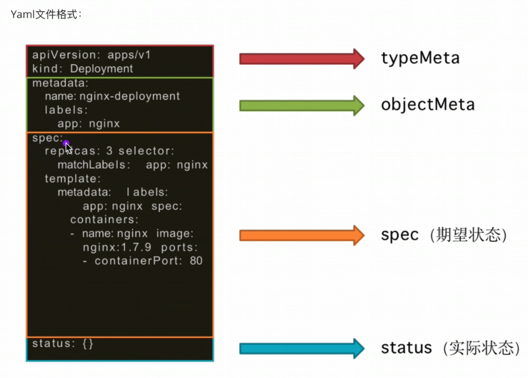

# 架构

## Master

- **api-server**
  - 负责处理接受请求的工作
- **etcd**
  - 一致且高可用的键值存储，用作 Kubernetes 所有集群数据的后台数据库。
- **Controller**
  - 负责控制和协调各个资源对象的创建、更新和删除，并确保集群中的实际状态与期望状态保持一致
  - ReplicaSet 控制器：
    - ReplicaSet 控制器用于确保在集群中运行指定数量的 Pod 副本。
    - 它通过根据定义的副本数和选择器来创建、更新和删除 Pod。
    - 监控集群中的 Pod 实例数量，并在需要时进行调整。
  - Deployment 控制器：
    - Deployment 控制器在 ReplicaSet 控制器的基础上提供了更高级别的抽象。
    - 它用于管理应用程序的部署，并支持滚动升级和回滚。
    - Deployment 控制器可以自动创建和管理 ReplicaSet，以确保指定数量的 Pod 副本在集群中运行。
  - StatefulSet 控制器：
    - StatefulSet 控制器用于管理有状态应用程序的部署。
    - 它确保有状态应用程序的每个实例都具有唯一的标识和稳定的网络标识符。
    - StatefulSet 控制器还支持有序的创建、更新和删除操作，以维护应用程序的稳定性。
- **Scheduler**
  - 调度决策考虑的因素包括单个 Pod 及 Pods 集合创建在哪个node上


## Node

- kube-let
  - 每个节点上运行的主要 “节点代理”。它可以使用以下方式之一向 API 服务器注册：
    - 主机名（hostname）；
    - 覆盖主机名的参数；
    - 特定于某云驱动的逻辑。

- kube-proxy
  - 网络代理
- pod
  - Pod 中可以运行多个containers


# 网络

## K8s 网络分为以下几个层级

- **容器内部通信层**
  - 每个 Pod 内的容器可以使用 localhost 或 Pod IP 地址进行通信。
  - 在同一个 Pod 内的容器可以通过 localhost:port 的方式相互访问。

- **Pod 间通信层**
  - Pod 间的通信是通过 Pod 网络进行的。在 Kubernetes 中，每个 Pod 都会被分配一个唯一的 Pod IP 地址。Pod IP 是在 Pod 创建时由 Kubernetes 分配的，并且它在 Pod 的生命周期内保持不变。

- 在**同一个 Node 上的两个 Pod** 
  - 可以直接使用 Pod IP 进行通信，因为它们位于同一个 Pod 网络中。
- **在不同 Node 上的 Pod** 
  - 之间的通信需要经过网络层的路由，Kubernetes 通过网络插件（例如 Flannel、Calico、Weave 等）来实现 Pod 网络的连通性。

- **Service 层**
  - Kubernetes Service 提供了一种抽象机制，用于为一组 Pod 提供统一的入口，并通过负载均衡实现与这些 Pod 的通信。Service 有自己的虚拟 IP 地址（Cluster IP），并使用该 IP 地址对外暴露服务。
  - 当创建一个 Service 时，Kubernetes 会自动创建一个负载均衡器（如 iptables、IPVS 等），它负责将请求转发到 Service 关联的一组 Pod 上。
  - Service 的负载均衡器会根据内部的代理规则将请求转发给后端 Pod，这些规则可以基于轮询、会话粘滞等策略进行配置。


## K8S 四层网络

- node节点网络 nodeIp+port = 节点主机相互

- Pod网络 podIp+port = Pod 虚机互联互通

- service 网络 clusterIp+port  = 服务发现和负载均衡

- 外部接入 nodePort/Ingress = 外部流量接入

  |              |             作用              |             实现             |
  | :----------: | :---------------------------: | :--------------------------: |
  |   节点网络   | Master/Worker节点之间网络通信 |      路由器/交换机/网卡      |
  |   POD 网络   |        POD 虚拟机之间         |       虚拟机/虚拟网桥        |
  | Service 网络 |       服务发现+负载均衡       | Kube-proxy, kubelet,kube-DNS |
  |   NodePort   |  将service 显露在节点网络上   |          Kube-proxy          |
  | LoadBalancer |                               |      公有云LB+NodePort       |
  |   Ingress    |           反向路由            |        nginx/traefik         |

  

## 网络插件

- fannel

  - 配置、使用相对简单。它通过创建一个**虚拟的子网**来为容器提供网络连接，无需复杂的网络拓扑配置
  - 跨主机通信：Flannel 通过**创建一个覆盖整个集群的网络**，使得在不同主机上运行的容器可以直接通过 IP 地址进行通信，无需进行端口映射或网络地址转换
  - 劣势
    - 需要封包、解包，有网络的性能损耗
    - 无内置安全机制，如网络隔离、认证和加密

- Calico 

  - 基于路由的网络模型。它使用了每个节点上的路由表来实现容器间的直接通信
  - 包括网络隔离、策略控制、网络加密等

  

- podDNS

  - 1.pod的DNS域名为<pod-ip>,<namespace>.pod.<cluster-domain>,其中pod-ip中要用-"替换"."，如: 10-0-95-63.default.pod.cluster.local是ip为10.0.95.63的pod的域名
  - POD的DNS策略
    - 默认值:继承窗格所在宿主机的域名解析设置
    - 集群优先:优先使用k8s环境中的域名服务
    - 集群第一与主机网:适用于以主机网工作的吊舱
    - None:忽略k8s的DNS配置，需要手工通过dnsConfig自定义DNS配置


## K8S 端口分类

- NodePort
  - 提供了 "集群外部" 客户端访问 Service 的端口
  - 通过 nodeIP:nodePort 提供了外部流量访问k8s集群中service的入口

- Port
  - port是暴露在cluster ip上的端口
  - port提供了 "集群内部" 客户端访问service的入口，
    即clusterIP:port

## K8S 网络请求过程

- 客户端发起请求
  - 请求可以来自外部用户或其他应用程序。客户端可以使用 Service IP、Ingress IP 或集群的外部 IP 来访问 Kubernetes 集群。

- DNS 解析
  - 如果请求使用 Service 名称作为目标，Kubernetes 中的 DNS 服务会将该名称解析为相应的 Service IP 地址。
  - 如果请求使用 Ingress 名称作为目标，DNS 服务会将其解析为 Ingress 控制器的 IP 地址。

- 集群入口点
  - 根据 DNS 解析的结果，请求被路由到 Kubernetes 集群的入口点，通常是负载均衡器或 Ingress 控制器。

- 负载均衡和路由
  - 负载均衡器或 Ingress 控制器会根据配置的规则将请求转发到相应的 Service 或 Pod 上。
  - 这可能涉及基于轮询、会话粘滞等负载均衡策略。

- Service 代理
  - 如果请求的目标是一个 Service，请求会进一步被转发到该 Service 关联的一组 Pod 上。
  - 这通常是通过 Service 代理或负载均衡器实现的。

- Pod 选择
  - Service 代理或负载均衡器会根据负载均衡策略选择要处理请求的目标 Pod。
  - 选择可以基于轮询、随机选择等策略。

- 请求处理
  - 选定的 Pod 接收到请求后，会根据请求的类型和目标应用程序进行相应的处理。
  - 这可能涉及应用程序逻辑、数据库查询、文件操作等。

- 响应返回
  - Pod 处理请求后生成响应，并将其返回给发起请求的客户端。


# POD生命周期

在 Kubernetes 中，Pod 是最小的可部署单元，表示一个或多个容器的组合。Pod 具有以下生命周期阶段：

### Pending（挂起）

- 当创建 Pod 时，它会进入 Pending 阶段。
- 在此阶段，Kubernetes 正在为 Pod 分配资源（如 CPU 和内存），并等待这些资源可用。
- 如果所有的资源分配都成功，Pod 将进入下一个阶段。

### ContainerCreating

- 容器正在创建中。

### Running

- 在 Running 阶段，Pod 中的容器正在运行。
- 容器将在 Pod 中运行，并根据定义的规范执行其任务。
- 此阶段中的容器可以被创建、启动、重启等。

### Successed

- 当 Pod 中的所有容器成功完成其任务并退出时，Pod 将进入 Succeeded 阶段。
- 在此阶段，Pod 将保持运行状态，但不再重启或执行其他操作。
- 可以使用命令 `kubectl logs <pod名称>` 检查容器的日志输出。

### Failed

- 如果 Pod 中的任何容器失败并退出，Pod 将进入 Failed 阶段。
- 在此阶段，Pod 将保持运行状态，并尝试重启容器以解决问题。
- 可以使用命令 `kubectl describe pod <pod名称>` 获取有关失败原因的详细信息。

### Unknown

- 如果无法获取 Pod 的状态信息，则将其标记为 Unknown 阶段。
- 这可能是由于与 Pod 通信的问题导致的。
- 一旦通信恢复，Pod 的状态将被更新。


### Terminating

- Pod 正在终止中。

### CrashLoopBackOff 

- 容器在短时间内连续崩溃和重启。


# Pod清单

**一级清单**

```go
 kubectl explain pods
```


**二级清单**

```go
# 查看二级清单时，只需要.（点）二级清单名称即可，如下
kubectl explain pods.metadata
```


**详细清单**

```yaml
apiVersion: v1     #必选，版本号，例如v1
kind: Pod       　 #必选，资源类型，例如 Pod
metadata:       　 #必选，元数据
  name: string     #必选，Pod名称
  namespace: string  #Pod所属的命名空间,默认为"default"
  labels:       　　  #自定义标签列表
    - name: string      　          
spec:  #必选，Pod中容器的详细定义
  containers:  #必选，Pod中容器列表
  - name: string   #必选，容器名称
    image: string  #必选，容器的镜像名称
    imagePullPolicy: [ Always|Never|IfNotPresent ]  #获取镜像的策略 
    command: [string]   #容器的启动命令列表，如不指定，使用打包时使用的启动命令
    args: [string]      #容器的启动命令参数列表
    workingDir: string  #容器的工作目录
    volumeMounts:       #挂载到容器内部的存储卷配置
    - name: string      #引用pod定义的共享存储卷的名称，需用volumes[]部分定义的的卷名
      mountPath: string #存储卷在容器内mount的绝对路径，应少于512字符
      readOnly: boolean #是否为只读模式
    ports: #需要暴露的端口库号列表
    - name: string        #端口的名称
      containerPort: int  #容器需要监听的端口号
      hostPort: int       #容器所在主机需要监听的端口号，默认与Container相同
      protocol: string    #端口协议，支持TCP和UDP，默认TCP
    env:   #容器运行前需设置的环境变量列表
    - name: string  #环境变量名称
      value: string #环境变量的值
    resources: #资源限制和请求的设置
      limits:  #资源限制的设置
        cpu: string     #Cpu的限制，单位为core数，将用于docker run --cpu-shares参数
        memory: string  #内存限制，单位可以为Mib/Gib，将用于docker run --memory参数
      requests: #资源请求的设置
        cpu: string    #Cpu请求，容器启动的初始可用数量
        memory: string #内存请求,容器启动的初始可用数量
    lifecycle: #生命周期钩子
        postStart: #容器启动后立即执行此钩子,如果执行失败,会根据重启策略进行重启
        preStop: #容器终止前执行此钩子,无论结果如何,容器都会终止
    livenessProbe:  #对Pod内各容器健康检查的设置，当探测无响应几次后将自动重启该容器
      exec:       　 #对Pod容器内检查方式设置为exec方式
        command: [string]  #exec方式需要制定的命令或脚本
      httpGet:       #对Pod内个容器健康检查方法设置为HttpGet，需要制定Path、port
        path: string
        port: number
        host: string
        scheme: string
        HttpHeaders:
        - name: string
          value: string
      tcpSocket:     #对Pod内个容器健康检查方式设置为tcpSocket方式
         port: number
       initialDelaySeconds: 0       #容器启动完成后首次探测的时间，单位为秒
       timeoutSeconds: 0    　　    #对容器健康检查探测等待响应的超时时间，单位秒，默认1秒
       periodSeconds: 0     　　    #对容器监控检查的定期探测时间设置，单位秒，默认10秒一次
       successThreshold: 0
       failureThreshold: 0
       securityContext:
         privileged: false
  restartPolicy: [Always | Never | OnFailure]  #Pod的重启策略
  nodeName: <string> #设置NodeName表示将该Pod调度到指定到名称的node节点上
  nodeSelector: obeject #设置NodeSelector表示将该Pod调度到包含这个label的node上
  imagePullSecrets: #Pull镜像时使用的secret名称，以key：secretkey格式指定
  - name: string
  hostNetwork: false   #是否使用主机网络模式，默认为false，如果设置为true，表示使用宿主机网络
  volumes:   #在该pod上定义共享存储卷列表
  - name: string    #共享存储卷名称 （volumes类型有很多种）
    emptyDir: {}       #类型为emtyDir的存储卷，与Pod同生命周期的一个临时目录。为空值
    hostPath: string   #类型为hostPath的存储卷，表示挂载Pod所在宿主机的目录
      path: string      　　        #Pod所在宿主机的目录，将被用于同期中mount的目录
    secret:       　　　#类型为secret的存储卷，挂载集群与定义的secret对象到容器内部
      scretname: string  
      items:     
      - key: string
        path: string
    configMap:         #类型为configMap的存储卷，挂载预定义的configMap对象到容器内部
      name: string
      items:
      - key: string
        path: string
```


# yaml 格式



