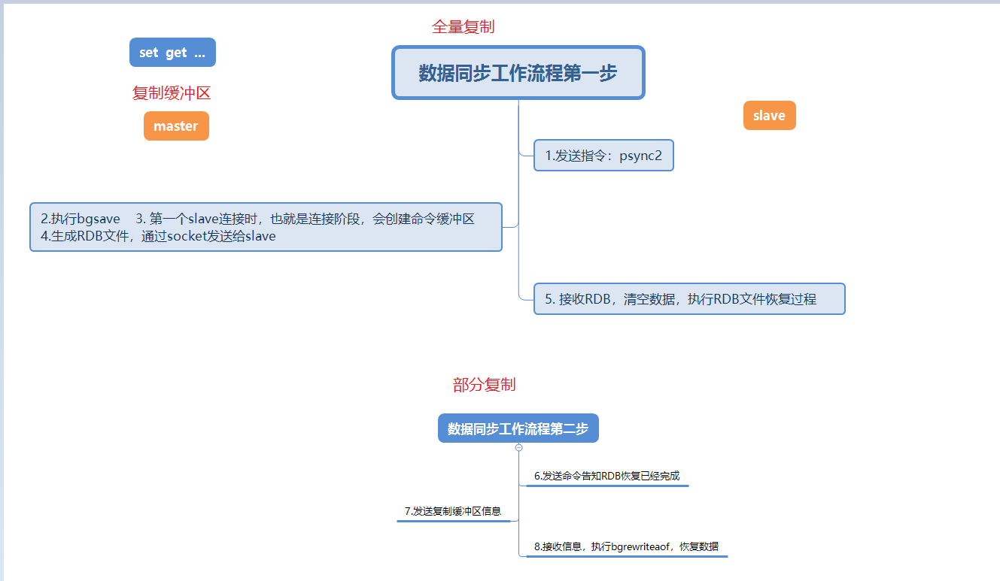
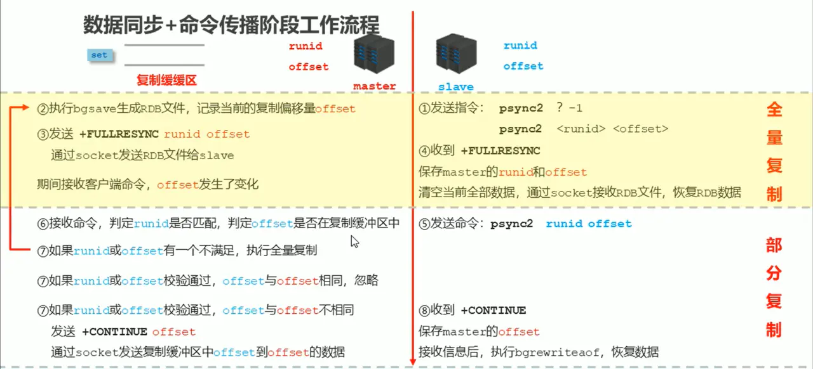

# redis 


## 主从复制

### docker-compose

```go
version: '3'

services:

  redis-master:
    image: redis:6.2.6
    container_name: redis-master
    command: redis-server --appendonly yes --repl-ping-slave-period 10 --repl-backlog-size 1048576 --repl-backlog-ttl 3600
    volumes:
      - ./redis-master-data:/data
    ports:
      - 6379:6379

  redis-slave1:
    image: redis:6.2.6
    container_name: redis-slave1
    command: redis-server --slaveof redis-master 6379
    volumes:
      - ./redis-slave1-data:/data
    depends_on:
      - redis-master

  redis-slave2:
    image: redis:6.2.6
    container_name: redis-slave2
    command: redis-server --slaveof redis-master 6379
    volumes:
      - ./redis-slave2-data:/data
    depends_on:
      - redis-master

```

#### 启动

```go
// 用于存储数据
mkdir redis-master-data redis-slave1-data redis-slave2-data 

// 启动 
docker-compose up -d 

// 查看启动状态
dcoker ps | grep redis 
```


#### 主从状态查看

```bash
# 进入master
docker exec -it redis-master bash 

# 启动客户端
redis-cli 

# 获取信息
info replication

```

#### info replication

```go
127.0.0.1:6379> info replication
# Replication
role:master
connected_slaves:0
master_failover_state:no-failover
master_replid:d16c9815b62b50c96e824ca07f3596d83add394e
master_replid2:0000000000000000000000000000000000000000
master_repl_offset:0
second_repl_offset:-1
repl_backlog_active:0
repl_backlog_size:1048576
repl_backlog_first_byte_offset:0
repl_backlog_histlen:0
127.0.0.1:6379> info replication
# Replication
role:master
connected_slaves:0
master_failover_state:no-failover
master_replid:d16c9815b62b50c96e824ca07f3596d83add394e
master_replid2:0000000000000000000000000000000000000000
master_repl_offset:0
second_repl_offset:-1
repl_backlog_active:0
repl_backlog_size:1048576
repl_backlog_first_byte_offset:0
repl_backlog_histlen:0
```


#### 参数说明

```go
// 命令 
--appendonly yes
	这个参数开启了 Redis 的 AOF (Append Only File) 持久化机制。
	AOF 持久化会将每一个写命令都追加到硬盘上的日志文件中,这样可以在服务器重启时快速恢复数据。
--repl-ping-slave-period 10
	这个参数设置了主节点向从节点发送心跳的时间间隔为 10 秒。
	心跳机制可以让主节点监测从节点是否处于在线状态,从而及时发现并处理从节点断开的情况。
--repl-backlog-size 1048576
	这个参数设置了复制缓冲区的大小为 1MB (1048576 bytes)。
	复制缓冲区用于保存即将复制给从节点的数据。增大缓冲区可以提高主从复制的效率。
--repl-backlog-ttl 3600
	这个参数设置了复制缓冲区的保留时间为 3600 秒(1 小时)。
	如果从节点长时间断开,主节点会将缓冲区中的旧数据清除,避免内存占用过大。
--slaveof redis-master 6379
	这个参数用于将从节点连接到主节点。
	从节点会自动连接到地址为 redis-master:6379 的主节点,并开始同步数据。

```


### 原理

- 定义了三个 Redis 服务
  - 一个主服务器(`redis-master`)
  - 两个从服务器(`redis-slave1`和`redis-slave2`)。

- **主服务器配置**: 主服务器(`redis-master`)被配置为普通的 Redis 服务器,
  - 使用 `--appendonly yes` 参数启用持久化。

- **从服务器配置**: 从服务器(`redis-slave1`和`redis-slave2`)被配置为从属于主服务器。
  - 使用 `--slaveof redis-master 6379` 参数指定主服务器的地址和端口。
  -  使用 `repl-ping-slave-period 10`  参数 表示10秒进行一次请求

- **数据复制过程**:
  - 从服务器会定期(在默认情况下,从服务器会每 60 秒)向主服务器发送 `SYNC` 命令,请求全量数据复制。
    - 可通过配置（从服务器配置 reds.conf）
  - 主服务器接收到 `SYNC` 命令后,会启动一个后台进程,将当前数据库的所有数据导出到一个 RDB 文件,并发送给从服务器。
  - 从服务器接收到 RDB 文件后,会载入数据并开始对主服务器进行增量复制。从此之后,主服务器的任何写入操作都会被记录到一个缓冲区中,并同步发送给从服务器。
  - 从服务器接收到写入操作后,会立即更新自己的数据,确保与主服务器的数据一致。

### 数据同步阶段过程



第一次从节点连接主节点时的数据同步过程。 当从节点第一次连接主节点时，先会执行一次全量复制这次的全量复制是无法避免的。 全量复制执行完成后，主节点就会发送复制积压缓冲区的数据，然后从节点就会执行bgrewriteaof恢复数据，这也就是部分复制。 在这个阶段提到了三个新点，全量复制、部分复制、复制缓冲积压区。会在下文的常见问题里详细说明这几个点。

### 命令传播阶段

当master数据库被修改后，主从服务器的数据不一致后，此时就会让主从数据同步到一致，这个过程称之为命令传播。 master会将接收到的数据变更命令发送给slave，slave接收命令后执行命令，让主从数据达到一致。 命令传播阶段的部分复制

- 在命令传播阶段出现断网的情况，或者网络抖动时会导致连接断开（connection lost）
- 这个时候主节点master还是会继续往replbackbuffer（复制缓冲积压区）写数据
- 从节点会继续尝试连接主机（connect to master）
- 当从节点把自己的runid和复制偏移量发送给主节点，并且执行pysnc命令同步
- 如果master判断偏移量是在复制缓冲区范围内，就会返回continue命令。并且发送复制缓冲区的数据给从节点。
  - 从节点接收数据执行bgrewriteaof，恢复数据

- 如果不在。 进行全时备份
  - 由于从节点的 ID 不在主节点的复制缓冲区中,Redis 会自动触发一次全量同步。
  - 主节点会执行 `BGSAVE` 命令,将当前数据库的快照 (RDB 文件) 保存到磁盘上。
  - 主节点将该 RDB 文件发送给从节点,从节点接收并载入数据。
  - 这个过程会导致从节点的数据库被完全替换,从而保持与主节点的一致性。


## 详细主从复制原理 

### 全量&增量





```go
1. 从节点发送指令psync ? 1 psync runid offset 找对应的runid索取数据。但是这里可以考虑一下，当从节点第一次连接的时候根本就不知道主节点的runid 和 offset 。所以第一次发送的指令是psync ？ 1意思就是主节点的数据我全要。

2. 主节点开始执行bgsave生成RDB文件，记录当前的复制偏移量offset

3. 主节点这个时候会把自己的runid 和 offset 通过 +FULLRESYNC runid offset 指令 通过socket发送RDB文件给从节点。

4. 从节点接收到+FULLRESYNC 保存主节点的runid和offset 然后清空当前所有数据，通过socket接收RDB文件，开始恢复RDB数据。

5. 在全量复制后，从节点已经获取到了主节点的runid和offset，开始发送指令 psync runid offset

6. 主节点接收指令，判断runid是否匹配，判断offset是否在复制缓冲区中。

7. 主节点判断runid和offset有一个不满足，就会在返回到步骤2继续执行全量复制。这里的runid不匹配只有的可能是从节点重启了这个问题后边会解决，offset（偏移量）不匹配就是复制积压缓冲区溢出了。 如果runid或offset校验通过，从节点的offset和主节点的offset相同时则忽略。 如果runid或offset检验通过，从节点的offset与offset不相同，则会发送 +CONTINUE offset(这个offset为主节点的)，通过socket发送复制缓冲区中从节点offset到主节点offset的数据。

8. 从节点收到+CONTINUE 保存master的offset 通过socket接收到信息后，执行bgrewriteaof，恢复数据。

```


